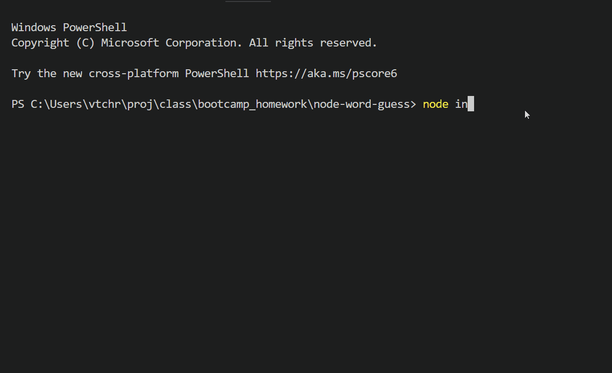

## Node Word Guess

## TECHNOLOGIES
<ul>
    <li>JavaScript</li>
    <li>Node.js</li>    
</ul>

#CONCEPTS APPLIED
<ul>
    <li>Object Constructors</li>
    <li>Modular Code</li>
    <li>Inquirer for user interaction</li>    
</ul>

<ul>
    <li>From command line, in appropriate folder, type `node index`</li>
    <li>A random word will be selected and you will be prompted to guess a letter</li>
    <li>Type a letter and press `enter` </li>
    <li>If the letter is a part of the word it will be displayed, otherwise your remaining guesses will be reduced. </li>
    <li>Round Ends when you correctly guess all the letters, or run out of remaining guesses.</li>
    <li>Thanks for visiting, enjoy the game!</li>
</ul>